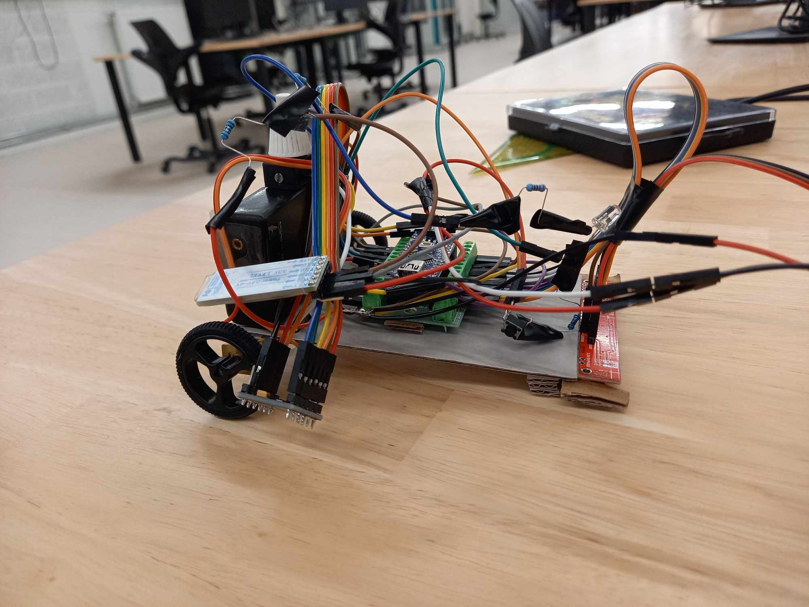

# LineFollower

lege repository die je als template kan gebruiken om een eigen repository te starten voor uw linefollower project

## specifications

microcontroller: ATMEGA328P (arduino nano)

motors: 6V DC 50:1

h-bridge: DRV8833

sensors: QTR-8A

batteries: 18650 Li-ion batterijen

wireless communication: HC-05

distance sensor - motors: 110mm

weight:

speed: 0.48

